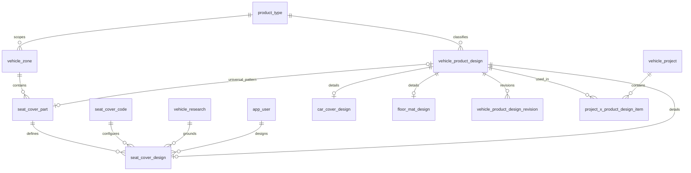

# /parts 화면 테이블 사용 및 상세 명세서

작성일: 2026-09-08  
기준: 제품군 콤보 제거 후 현재 소스와 `vehicle_fitment_schema_taeho.sql`  
범위: 화면에 표시된 8개 테이블 전체, 화면 입력·조회·생성·버전 추가 흐름 및 인접 테이블의 관계

## 1. 실제 저장 방식과 명세의 기준

현재 `/parts`는 DB API나 SQL을 직접 실행하지 않는다. 화면의 Tables 표시는 개발 환경에서만 노출되는 정적 데이터 모델 안내이며, 실제 테이블 조회 이력은 아니다.

| 데이터                                                 | 현재 출처/저장 위치                                                              | 사용 코드                          |
| ------------------------------------------------------ | -------------------------------------------------------------------------------- | ---------------------------------- |
| Part Type, Code, 차량 구역, 프로젝트와 프로젝트별 설계 | Workbench store. 초기 mock 데이터 및 `localStorage['coverland-rd-workbench-v1']` | `workbench-store.tsx`              |
| 공용 파츠 목록, 설계 상세, 버전 배열                   | `localStorage['coverland-part-library-v1']`                                      | `part-library.ts`                  |
| 생성자/설계자                                          | `CURRENT_USER_ID = 'USR-KAI'` 상수                                               | `current-user.ts`                  |
| SQL 컬럼·관계·제약조건                                 | 저장소의 PostgreSQL DDL                                                          | `vehicle_fitment_schema_taeho.sql` |

이 문서의 DB 명세는 DDL에 선언된 구조이다. 실행 중인 DB의 배포 상태를 확인한 문서는 아니다. 아래의 읽기·생성·추가는 **화면 모델 기준의 동작**이며 현재 SQL CRUD를 의미하지 않는다.

신규 생성은 `Seat Cover`로 고정되어 있다. 단, `importProjectParts()`는 모든 프로젝트의 설계를 제품군 필터 없이 가져온다. 따라서 기존 저장 데이터 및 가져온 데이터에 Car Cover/Floor Mat가 있으면 목록과 버전 이력에 나타날 수 있다.

## 2. 각 테이블은 화면 어디에 쓰이는가

| 테이블                            | 화면 위치                                                        | 구체적인 사용                                                                                                             | 현재 동작 범위                                                          |
| --------------------------------- | ---------------------------------------------------------------- | ------------------------------------------------------------------------------------------------------------------------- | ----------------------------------------------------------------------- |
| `vehicle_zone`                    | 생성기 상단 1열/2열/3열 선택                                     | 선택한 F/B/E와 구역 code를 비교하고, Part Type의 vehicleZoneId와 구역 id를 연결해 해당 열의 부품만 추림                   | 기준정보 읽기. 탭 문구·F/B/E 값 자체는 하드코딩                         |
| `seat_cover_part`                 | 부위 선택 후 Part Type 콤보, 커스텀/유니버설 선택, 이름 미리보기 | ACTIVE + 선택 열 + category + isCustom 조건으로 후보를 추림. name은 생성 이름의 첫 부분, id는 설계의 seatCoverPartId가 됨 | 기준정보 읽기. `+ Part 생성`은 이 사전에 새 종류를 등록하는 동작이 아님 |
| `seat_cover_code`                 | Code 콤보, 이름 미리보기                                         | ACTIVE 코드만 노출. code 문자열을 이름에 사용하고 해당 id를 seatCoverCodeId로 보관                                        | 기준정보 읽기                                                           |
| `vehicle_product_design`          | Part Name 미리보기, 생성 버튼, 목록·검색·선택                    | 생성한 파츠의 공통 식별자/이름/제품군에 대응. 목록에서는 이름·제품군·분류·최종 배열 항목의 버전을 표시                    | 공용 라이브러리 객체 생성·읽기. 기존 이름/상태를 수정하는 UI 없음       |
| `seat_cover_design`               | Part Type, Side, 부위 다이어그램, 커스텀/유니버설 입력           | seatCoverPartId, seatCoverCodeId, side, designedBy 등 SEAT_COVER 상세에 대응                                              | 신규 생성 및 기존 상세 보관. SQL 행과 완전 일치하지 않음                |
| `vehicle_product_design_revision` | Version note, 목록의 v번호, Version History, 새 버전 추가        | 최초 v1 생성. 변경 내용을 입력하면 현재 최대 revisionNumber + 1로 버전을 추가하고 생성자·시각 표시                        | 생성·읽기·추가. 과거 버전 편집/삭제 UI 없음                             |
| `car_cover_design`                | 기존 Car Cover 데이터가 있을 때 목록/이력의 내부 상세            | 프로젝트에서 가져온 CAR_COVER details를 보관. 이 화면은 전용 컬럼을 별도 폼으로 표시하지 않음                             | 신규 생성 경로 없음. 기존 파츠의 공통 이력 기능은 가능                  |
| `floor_mat_design`                | 기존 Floor Mat 데이터가 있을 때 목록/이력의 내부 상세            | 프로젝트에서 가져온 FLOOR_MAT details를 보관. 이 화면은 전용 컬럼을 별도 폼으로 표시하지 않음                             | 신규 생성 경로 없음. 기존 파츠의 공통 이력 기능은 가능                  |

### 2.1 화면 입력 → 데이터 대응

| 입력/표시                     | 처리                                                                  | 대응 위치                                                                                |
| ----------------------------- | --------------------------------------------------------------------- | ---------------------------------------------------------------------------------------- |
| 제품군                        | 입력 없이 Seat Cover 고정                                             | 현재 `LibraryPart.product`; DB는 `vehicle_product_design.product_type_id` FK로 변환 필요 |
| 1열/2열/3열                   | F/B/E로 Part Type 필터                                                | `seat_cover_part.vehicle_zone_id` → `vehicle_zone.id`                                    |
| 헤드레스트/등받이/방석/팔걸이 | HEADREST/TOP/BOTTOM/ARM category 필터, 선택 위치로 Side도 변경        | `seat_cover_part.category`; 다이어그램 버튼은 하드코딩                                   |
| 커스텀/유니버설               | `isCustom`에 맞는 Part Type 필터; 유니버설이면 Make/Model 입력 숨김   | 사전 `seat_cover_part.is_custom`, 현재 details.isCustom                                  |
| Part Type                     | 선택한 id·name·category를 사용                                        | `seat_cover_design.seat_cover_part_id`; 일부 값은 UI에 복사 저장                         |
| Make/Model Abbreviation       | trim → 대문자 → A–Z/0–9 외 제거                                       | 생성 이름에만 포함. 이 폼에서는 make/model 테이블을 조회하거나 FK를 저장하지 않음        |
| Initial                       | Make/Model과 같은 정규화                                              | 생성 이름에만 포함. 설계자 FK와 별개                                                     |
| Code                          | 선택 문자열은 이름에, id는 상세에 사용                                | `seat_cover_code.code`, `seat_cover_design.seat_cover_code_id`                           |
| Side                          | DRIVER/PASSENGER/CENTER/UNIVERSAL                                     | 현재 details.side; DB side 허용값과 차이 있음                                            |
| Part Name                     | 아래 규칙으로 조합                                                    | `vehicle_product_design.name`에 대응                                                     |
| Version note/변경 내용        | 최초 비어 있으면 `Initial version`; 이후 공백만 있는 메모는 추가 불가 | `vehicle_product_design_revision.note`                                                   |
| 작성자/생성시각               | 사용자 상수 및 `new Date().toISOString()`                             | `designed_by`, `created_by`, `created_at`에 대응                                         |

커스텀 이름: `{PartType.name}-{MAKE}-{MODEL}-{Code}-{Initial}-{Side 첫 글자}`  
유니버설 이름: `{PartType.name}-UNIVERSAL-{Code}-{Initial}-{Side 첫 글자}`  
예시 조합: `FH-AC-MX-424BEN-W-D` — 형식 설명용이며 해당 사전 데이터의 존재를 보장하는 예시는 아니다.

생성 조건은 Part Type, Initial, Code가 있고 커스텀일 때 Make/Model도 있는 것이다. 이름 중복은 라이브러리 전체에 대해 대소문자를 무시하고 검사한다. 현재 이름에는 별도 연식 입력이나 버전 접미사가 없다.

### 2.2 저장 및 연결 흐름

1. 페이지 진입 후 각 프로젝트의 designs를 라이브러리로 가져온다. 이름이 대소문자 무시 기준으로 이미 있으면 건너뛴다. 가져오기 시 라이브러리 id는 새 UUID이고, 버전의 id/번호/메모/생성자/생성시각을 복사한다. 승인 필드는 복사하지 않는다.
2. 생성 버튼은 `{ id, name, product, type, details, revisions: [v1] }` 한 객체를 라이브러리에 저장한다. `seat_cover_part`나 `seat_cover_code` 기준정보를 생성하지 않는다.
3. 목록에서 파츠를 선택하면 해당 revisions 배열을 Version History로 표시한다. 검색 대상은 name/product/type이고 버전 메모는 검색하지 않는다.
4. 새 버전 추가는 기존 파츠 객체의 revisions에 새 항목을 붙여 라이브러리를 다시 저장한다. 설계 상세나 패턴 파일을 수정/업로드하는 기능은 이 버튼에 없다.
5. 유효한 `returnTo`가 있으면 생성 후 `/vehicle-projects?...&linkPart=<id>`로 이동한다. 실제 연결은 프로젝트 화면의 `part-link-dialog.tsx`에서 버전과 수량을 선택해 실행한다.
6. 프로젝트 연결 시 libraryPartId/libraryRevisionId와 선택 버전의 복사본을 보관한다. 이후 라이브러리에 새 버전을 추가해도 기존 프로젝트의 복사본은 자동 갱신되지 않는다.

## 3. 공통 SQL 규칙

- 아래 8개 테이블의 `id`는 모두 `UUID PRIMARY KEY DEFAULT uuidv7()`이다. 현재 화면 생성은 `crypto.randomUUID()`를 사용한다.
- 모든 테이블의 `created_at`, `updated_at`은 `TIMESTAMPTZ NOT NULL DEFAULT now()`이다.
- 각 테이블에는 `set_updated_at()`을 호출하는 BEFORE UPDATE 트리거가 있다. updated_at 외 값이 바뀔 때 갱신하며, 실질적인 변경이 없는 UPDATE는 그대로 둔다.
- 각 테이블에는 INSERT/UPDATE/DELETE 후 `capture_entity_log()`를 실행하는 감사 트리거가 선언되어 있다. 작성 주체는 트랜잭션의 `app.actor_id`에서 읽는다. 현재 localStorage 동작에는 이 DB 트리거가 실행되지 않는다.
- PK/UNIQUE는 PostgreSQL의 인덱스를 수반한다. 아래 '별도 인덱스'는 DDL에 명시한 추가 인덱스이다.
- FK 삭제 동작은 명시된 CASCADE 외에는 기본 NO ACTION이다. 이는 참조가 남은 행의 삭제를 제한한다.
- 표의 필수는 NOT NULL 또는 PK 기준이다. 기본값은 입력 생략 시 적용되며 NULL 입력을 대체하지 않는다.

## 4. 핵심 테이블 상세 명세

### 4.1 vehicle_zone — 제품군별 차량 구역

한 행은 특정 제품군의 차량 구역 하나다. 이 페이지에서는 좌석 열에 맞는 Part Type을 찾는 연결 기준이다.

| 컬럼            | 타입        | 필수 | 기본값/제약          | 의미 및 화면 사용                                                 |
| --------------- | ----------- | ---- | -------------------- | ----------------------------------------------------------------- |
| id              | UUID        | Y    | PK, uuidv7()         | Part Type의 vehicleZoneId와 연결                                  |
| product_type_id | UUID        | Y    | FK → product_type.id | 해당 구역의 제품군. 현재 파츠 필터는 이 컬럼을 직접 검사하지 않음 |
| code            | TEXT        | Y    | 제품군별 UNIQUE      | 화면의 F/B/E와 비교                                               |
| name            | TEXT        | Y    | 제품군별 UNIQUE      | 구역 명칭. 현재 탭 표시 문구는 이 값을 읽지 않음                  |
| created_at      | TIMESTAMPTZ | Y    | now()                | 생성 시각                                                         |
| updated_at      | TIMESTAMPTZ | Y    | now()                | 변경 시각                                                         |

복합 UNIQUE: `(product_type_id, code)`, `(product_type_id, name)`. 별도 인덱스 없음. 코드의 허용값 CHECK는 없으므로 F/B/E는 DB 제한이 아닌 현재 UI 선택값이다.

### 4.2 seat_cover_part — Seat Cover 부품 종류 사전

한 행은 FH/FA/FMB 등 패턴 부품의 종류이다. 이 화면에서 생성하는 개별 차량용 파츠 설계와 구분된다.

| 컬럼                      | 타입        | 필수 | 기본값/제약                            | 의미 및 화면 사용                                                          |
| ------------------------- | ----------- | ---- | -------------------------------------- | -------------------------------------------------------------------------- |
| id                        | UUID        | Y    | PK, uuidv7()                           | Part Type 선택 값                                                          |
| name                      | TEXT        | Y    | UNIQUE                                 | Part Type 이름 및 생성 이름의 접두부                                       |
| description               | TEXT        | N    | —                                      | 설명. 현재 생성기에 표시하지 않음                                          |
| vehicle_zone_id           | UUID        | Y    | FK → vehicle_zone.id                   | 해당 좌석 열                                                               |
| category                  | TEXT        | Y    | CHECK 없음                             | HEADREST/TOP/BOTTOM/ARM 등. 부위 필터 및 목록 type                         |
| is_for_middle_seat        | BOOLEAN     | Y    | false                                  | 사전의 중앙 좌석 변형 여부. 현재 후보 필터는 이 값을 검사하지 않음         |
| is_custom                 | BOOLEAN     | Y    | true                                   | 커스텀/유니버설 후보 필터                                                  |
| vehicle_product_design_id | UUID        | N    | UNIQUE, FK → vehicle_product_design.id | 기존 유니버설 부품 자체의 패턴 참조. 현재 생성기는 이 링크를 사용하지 않음 |
| status                    | TEXT        | Y    | ACTIVE; CHECK ACTIVE/INACTIVE          | ACTIVE만 후보에 표시                                                       |
| created_at                | TIMESTAMPTZ | Y    | now()                                  | 생성 시각                                                                  |
| updated_at                | TIMESTAMPTZ | Y    | now()                                  | 변경 시각                                                                  |

별도 인덱스: `seat_cover_part_vehicle_zone_id_idx(vehicle_zone_id)`.

DDL 주석의 업무 규칙은 `is_custom = false`이면 설계 링크가 있고, true이면 없다는 것이다. 이 동치 조건은 DB CHECK로 강제되지 않고 앱에서 보장하도록 되어 있다. FK는 상호 참조 때문에 테이블 생성 뒤 ALTER TABLE로 추가된다. 이는 제약 검사를 지연하는 DEFERRABLE 선언이라는 뜻은 아니다.

### 4.3 seat_cover_code — 좌석 구성 코드 사전

한 행은 424BEN 등 좌석 구성 코드이다. DDL상 코드 자체는 연식을 포함하지 않는 개념이며 웹사이트 size code와도 별개다.

| 컬럼        | 타입        | 필수 | 기본값/제약                   | 의미 및 화면 사용               |
| ----------- | ----------- | ---- | ----------------------------- | ------------------------------- |
| id          | UUID        | Y    | PK, uuidv7()                  | 선택 코드의 상세 FK 값          |
| code        | TEXT        | Y    | UNIQUE                        | Code 옵션 및 생성 이름에 포함   |
| description | TEXT        | N    | —                             | 설명. 이 화면에서 표시하지 않음 |
| status      | TEXT        | Y    | ACTIVE; CHECK ACTIVE/INACTIVE | ACTIVE만 선택 가능              |
| created_at  | TIMESTAMPTZ | Y    | now()                         | 생성 시각                       |
| updated_at  | TIMESTAMPTZ | Y    | now()                         | 변경 시각                       |

별도 인덱스 없음. `seat_cover_code_x_option_value`를 통한 차량 옵션 기반 코드 추천은 현재 `/parts`에서 사용하지 않는다. 열/부위/차량과 상관없이 ACTIVE 코드 전체를 표시한다.

### 4.4 vehicle_product_design — 공통 설계 원장

한 행은 고유한 이름을 가진 제품 설계이다. Seat Cover 상세와 버전 이력의 부모 역할이다.

| 컬럼            | 타입        | 필수 | 기본값/제약                   | 의미 및 화면 사용                                         |
| --------------- | ----------- | ---- | ----------------------------- | --------------------------------------------------------- |
| id              | UUID        | Y    | PK, uuidv7()                  | 라이브러리 파츠 id에 대응                                 |
| product_type_id | UUID        | Y    | FK → product_type.id          | 신규 Seat Cover의 제품군 FK. 현재는 product 문자열로 저장 |
| name            | TEXT        | Y    | UNIQUE                        | 생성된 Part Name, 목록 제목, 검색·중복 검사               |
| status          | TEXT        | Y    | ACTIVE; CHECK ACTIVE/INACTIVE | 현재 LibraryPart에는 이 필드가 없음                       |
| created_at      | TIMESTAMPTZ | Y    | now()                         | 설계 생성 시각. 현재 LibraryPart 루트에는 없음            |
| updated_at      | TIMESTAMPTZ | Y    | now()                         | 설계 변경 시각. 현재 LibraryPart 루트에는 없음            |

별도 인덱스: `vehicle_product_design_product_type_id_idx(product_type_id)`.

DDL 주석은 name을 생성 시 확정하고 재생성하지 않는 업무 규칙으로 설명한다. 이름 불변 자체를 CHECK가 강제하지는 않는다. 일반 TEXT UNIQUE는 현재 UI의 대소문자 무시 중복 검사와 동일한 정책을 명시하지 않으므로 DB 연동 시 정책을 맞춰야 한다.

제품군별 상세 또는 유니버설 링크의 올바른 조합은 앱에서 보장해야 한다. DDL 주석의 상세 종류 나열에는 Floor Mat가 빠져 있지만 실제 `floor_mat_design` 테이블과 FK는 존재한다.

### 4.5 seat_cover_design — Seat Cover 설계 상세

한 행은 특정 조사 차량·부품 종류·좌석 코드·Side 조합의 패턴 설계이다.

| 컬럼                      | 타입        | 필수 | 기본값/제약                                            | 의미 및 화면 사용                                   |
| ------------------------- | ----------- | ---- | ------------------------------------------------------ | --------------------------------------------------- |
| id                        | UUID        | Y    | PK, uuidv7()                                           | 상세 행 id. 현재 details에는 별도 id 없음           |
| vehicle_product_design_id | UUID        | Y    | UNIQUE; FK → vehicle_product_design.id, DELETE CASCADE | 공통 설계와 최대 1:1 연결                           |
| seat_cover_part_id        | UUID        | Y    | FK → seat_cover_part.id                                | 선택한 Part Type                                    |
| vehicle_research_id       | UUID        | Y    | FK → vehicle_research.id                               | 패턴의 기준 조사 차량. 현재 생성기는 빈 문자열 저장 |
| seat_cover_code_id        | UUID        | Y    | FK → seat_cover_code.id                                | 선택한 Code                                         |
| side                      | TEXT        | Y    | CHECK, 아래 참조                                       | 패턴 방향. 현재 UI enum과 다름                      |
| designed_by               | UUID        | Y    | FK → app_user.id                                       | 설계자. 현재 CURRENT_USER_ID 저장                   |
| created_at                | TIMESTAMPTZ | Y    | now()                                                  | 생성 시각                                           |
| updated_at                | TIMESTAMPTZ | Y    | now()                                                  | 변경 시각                                           |

Side 허용값: `D`, `P`, `U`, `MD`, `MP`, `MD_E`, `MP_E`. D/P는 방향별 스캔, U는 양쪽 공용, MD/MP는 미러링 쌍의 스캔한 원본 방향, MD_E/MP_E는 미러링 결과를 뜻한다. DDL 주석상 미러링 결과는 자체 스캔·리비전을 갖지 않는 업무 규칙이며 이 CHECK만으로 강제되지는 않는다.

복합 UNIQUE: `seat_cover_design_identity_key(seat_cover_part_id, vehicle_research_id, seat_cover_code_id, side)`. 같은 조합이면 기존 설계에 새 버전을 추가하는 업무 의미이다. 현재 화면은 이 조합이 아니라 이름 중복만 검사한다.

별도 인덱스:

- `seat_cover_design_vehicle_research_id_idx(vehicle_research_id)`
- `seat_cover_design_seat_cover_code_id_idx(seat_cover_code_id)`
- `seat_cover_design_designed_by_idx(designed_by)`

현재 details의 `partName`, `category`, `isCustom`, `isForMiddleSeat`는 이 SQL 테이블의 컬럼이 아니다. 앞의 세 값은 주로 부품 사전에서 가져온 복사 데이터이며, isForMiddleSeat는 현재 Side가 CENTER인지로 계산한다.

### 4.6 vehicle_product_design_revision — 설계 버전 이력

한 행은 하나의 설계에 속한 특정 버전이다. 화면에서는 revisions 배열 항목에 대응한다.

| 컬럼                      | 타입        | 필수 | 기본값/제약                    | 의미 및 화면 사용                                |
| ------------------------- | ----------- | ---- | ------------------------------ | ------------------------------------------------ |
| id                        | UUID        | Y    | PK, uuidv7()                   | 버전 id                                          |
| vehicle_product_design_id | UUID        | Y    | FK → vehicle_product_design.id | 소속 설계. 현재는 배열의 부모 객체로 표현        |
| revision_number           | SMALLINT    | Y    | CHECK >= 1                     | 생성 시 1; 추가 시 최대값 + 1                    |
| note                      | TEXT        | N    | —                              | 최초 Version note 및 변경 내용                   |
| sample_approved_at        | TIMESTAMPTZ | N    | 승인자와 NULL 여부 일치        | 샘플 승인 시각. `/parts`에는 승인 입력/표시 없음 |
| sample_approved_by        | UUID        | N    | FK → app_user.id               | 샘플 승인자. `/parts`에는 승인 입력/표시 없음    |
| created_by                | UUID        | Y    | FK → app_user.id               | 버전 생성자. 화면에서는 사용자 id 표시           |
| created_at                | TIMESTAMPTZ | Y    | now()                          | 화면에서 로컬 날짜/시간 문자열로 표시            |
| updated_at                | TIMESTAMPTZ | Y    | now()                          | 현재 UI 버전 모델에는 없음                       |

복합 UNIQUE: `(vehicle_product_design_id, revision_number)`. 승인 제약: `(sample_approved_at IS NULL) = (sample_approved_by IS NULL)`이므로 승인 시각과 승인자는 둘 다 있거나 둘 다 없어야 한다.

별도 인덱스: `vehicle_product_design_revision_created_by_idx(created_by)`, `vehicle_product_design_revision_sample_approved_by_idx(sample_approved_by)`.

부모 설계 FK에는 ON DELETE CASCADE가 없다. 버전이 남은 설계는 단순 삭제할 수 없다. DDL 주석상 SC/CC 버전에는 PATTERN_FILE asset이 필요하지만 앱 강제 규칙이며, 현재 파츠 화면은 메모만으로 버전을 추가한다.

## 5. 화면에 표시되어 있지만 신규 생성에는 쓰이지 않는 상세 테이블

### 5.1 car_cover_design

기존 CAR_COVER 상세의 모델 대응이다. 현재 화면에서 신규 Car Cover를 만들지 않는다.

| 컬럼                      | 타입        | 필수 | 기본값/제약                                            | 의미                |
| ------------------------- | ----------- | ---- | ------------------------------------------------------ | ------------------- |
| id                        | UUID        | Y    | PK, uuidv7()                                           | 상세 id             |
| vehicle_product_design_id | UUID        | Y    | UNIQUE; FK → vehicle_product_design.id, DELETE CASCADE | 공통 설계           |
| vehicle_research_id       | UUID        | Y    | UNIQUE; FK → vehicle_research.id                       | 조사 차량당 한 설계 |
| designed_by               | UUID        | Y    | FK → app_user.id                                       | 설계자              |
| created_at                | TIMESTAMPTZ | Y    | now()                                                  | 생성 시각           |
| updated_at                | TIMESTAMPTZ | Y    | now()                                                  | 변경 시각           |

별도 인덱스: `car_cover_design_designed_by_idx(designed_by)`. 차량 전체가 한 패턴이며 좌석 부품·좌석 코드·Side 컬럼은 없다.

### 5.2 floor_mat_design

기존 FLOOR_MAT 상세의 모델 대응이다. 현재 화면에서 신규 Floor Mat를 만들지 않는다.

| 컬럼                      | 타입        | 필수 | 기본값/제약                                            | 의미                  |
| ------------------------- | ----------- | ---- | ------------------------------------------------------ | --------------------- |
| id                        | UUID        | Y    | PK, uuidv7()                                           | 상세 id               |
| vehicle_product_design_id | UUID        | Y    | UNIQUE; FK → vehicle_product_design.id, DELETE CASCADE | 공통 설계             |
| vehicle_research_id       | UUID        | Y    | FK → vehicle_research.id                               | 기준 조사 차량        |
| vehicle_zone_id           | UUID        | Y    | FK → vehicle_zone.id                                   | 해당 금형의 차량 구역 |
| created_at                | TIMESTAMPTZ | Y    | now()                                                  | 생성 시각             |
| updated_at                | TIMESTAMPTZ | Y    | now()                                                  | 변경 시각             |

복합 UNIQUE: `(vehicle_research_id, vehicle_zone_id)`. 별도 인덱스: `floor_mat_design_vehicle_zone_id_idx(vehicle_zone_id)`. DDL상 스캔 기반 금형 형상이며 designed_by 컬럼이 없다.

## 6. 관계도 및 인접 테이블

다음은 SQL FK 관계이며 현재 localStorage 객체의 물리 구조와는 다르다.

| 인접 테이블                      | 역할                        | `/parts`와의 경계                                                        |
| -------------------------------- | --------------------------- | ------------------------------------------------------------------------ |
| `product_type`                   | 설계/구역의 제품군 원장     | 화면은 Seat Cover 문자열을 고정하며 원장 선택 UI 없음                    |
| `vehicle_research`               | 설계 기준 차량 조사         | SQL 필수 FK지만 파츠 생성기에 선택 입력 없음                             |
| `app_user`                       | 설계자·버전 생성자·승인자   | 현재 상수를 사용하며 사용자 원장을 직접 조회하지 않음                    |
| `seat_cover_code_x_option_value` | 좌석 코드 ↔ 차량 옵션값     | 현재 코드 추천/필터에 사용하지 않음                                      |
| `project_x_product_design_item`  | 프로젝트의 설계 구성과 수량 | 프로젝트 연결 시 대응할 테이블. `/parts` 자체에서는 SQL 행을 만들지 않음 |
| `entity_log`                     | DB 변경 감사 기록           | SQL 트리거가 처리. 파츠 화면의 Version History와 별개                    |
| `asset`                          | 패턴 파일 등 설계 산출물    | 이 페이지에 파일 업로드 UI 없음                                          |

프로젝트 연결 테이블의 DDL 컬럼은 `id UUID PK`, `vehicle_project_id UUID NOT NULL FK → vehicle_project.id ON DELETE CASCADE`, `vehicle_product_design_id UUID NOT NULL FK → vehicle_product_design.id`, `quantity INTEGER NOT NULL CHECK > 0`, `created_at/updated_at TIMESTAMPTZ NOT NULL DEFAULT now()`이다. id 기본값은 uuidv7()이다. `(vehicle_project_id, vehicle_product_design_id)`는 UNIQUE이며 design FK에 별도 인덱스가 있다. **선택한 버전을 저장할 revision FK 컬럼은 이 DDL에 없다.**

## 7. 현재 구현과 DB 명세 사이의 차이

아래는 현재 코드에서 확인한 차이이다. 이 문서 작성 과정에서 DB나 화면 동작을 변경하지 않았다.

| 항목                 | 현재 구현                                                      | DDL/업무 규칙과의 차이 및 연동 시 필요한 결정                                                                                       |
| -------------------- | -------------------------------------------------------------- | ----------------------------------------------------------------------------------------------------------------------------------- |
| 영속화               | localStorage JSON                                              | 서버 CRUD, 트랜잭션, FK 검증 연결 필요                                                                                              |
| 제품군               | `product: 'Seat Cover'`                                        | product_type UUID로 매핑 필요                                                                                                       |
| 조사 차량            | vehicleResearchId가 빈 문자열                                  | NOT NULL UUID FK에 저장 불가. 생성 전 조사 차량을 확정하거나 공용 파츠 구조를 별도 설계해야 함                                      |
| 사용자               | USR-KAI 등 문자열                                              | 실제 app_user UUID와 인증 사용자 연결 필요                                                                                          |
| Side                 | DRIVER/PASSENGER/CENTER/UNIVERSAL; 이름은 D/P/C/U              | DB enum D/P/U/MD/MP/MD_E/MP_E와 다름. DRIVER→D, PASSENGER→P, UNIVERSAL→U는 매핑 후보지만 CENTER는 직접 대응값이 없어 업무 정의 필요 |
| 유니버설             | 기존 사전 종류를 선택해 SEAT_COVER 상세를 새로 생성            | 사전의 유니버설 설계 링크를 재사용하는 규칙과 차이. 생성 가능 범위 및 링크 사용 방식 결정 필요                                      |
| 중앙 좌석            | Side로 isForMiddleSeat 계산; 후보 필터는 사전의 중앙 여부 무시 | 중앙 전용 Part Type과 Side의 일관성 검증 필요                                                                                       |
| 중복                 | 이름만 대소문자 무시 검사                                      | DB 설계 identity 복합 UNIQUE 및 이름 UNIQUE와 정책 정합성 필요                                                                      |
| 버전 번호            | 클라이언트에서 max + 1                                         | 동시 생성 시 같은 번호 가능. DB 트랜잭션/충돌 처리 필요                                                                             |
| 최신 버전 표시       | 목록은 revisions 배열 마지막 항목                              | 가져온 배열이 정렬되지 않으면 최대 번호와 다를 수 있음. 추가 번호 계산은 max를 사용                                                 |
| 프로젝트 버전 고정   | libraryRevisionId 및 버전 복사본                               | project_x_product_design_item에 revision FK가 없어 현재 DDL만으로 동일한 연결을 표현하지 못함                                       |
| 패턴 파일            | 메모만으로 v1/새 버전 생성                                     | DDL 주석의 SC 패턴 파일 필수 규칙은 미구현                                                                                          |
| 기존 설계 가져오기   | 이름이 같으면 건너뜀                                           | 프로젝트에서 수정된 상세/버전을 기존 라이브러리에 재동기화하는 로직은 아님                                                          |
| SEAT COVER 전용 범위 | 생성만 고정                                                    | 가져오기/목록은 타 제품군을 포함할 수 있음. 완전한 전용 목록이 필요하면 추가 필터 정책 필요                                         |

## 8. 소스 근거

- [화면 및 생성·이력 처리](../frontend/src/modules/parts/parts-page.tsx)
- [라이브러리 저장·가져오기](../frontend/src/modules/parts/part-library.ts)
- [프로젝트 버전·수량 연결](../frontend/src/modules/parts/part-link-dialog.tsx)
- [프론트엔드 데이터 타입](../frontend/src/shared/types/workbench.ts)
- [기준정보·프로젝트 store](../frontend/src/app/workbench-store.tsx)
- [현재 사용자 상수](../frontend/src/app/current-user.ts)
- [개발용 Tables 표시](../frontend/src/shared/components/page-header.tsx)
- [SQL 명세 원본](vehicle_fitment_schema_taeho.sql): vehicle_zone 467행, seat_cover_part 744행, seat_cover_code 767행, vehicle_product_design 801행, seat_cover_design 820행, car_cover_design 851행, floor_mat_design 891행, vehicle_product_design_revision 917행, project_x_product_design_item 1370행. 행 번호는 원본 변경 시 달라질 수 있다.
